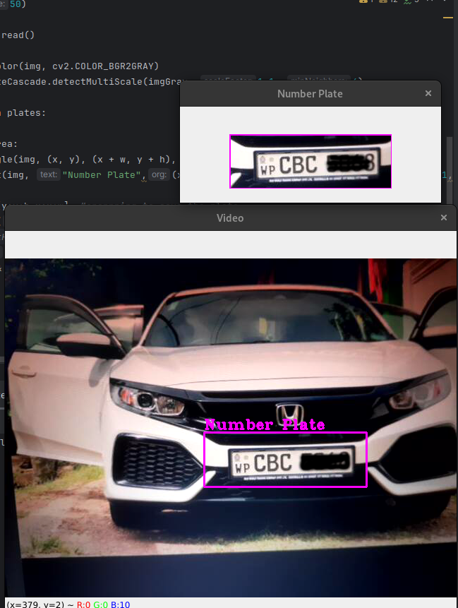

# OpenCV-Python
## Computer vision with OpenCV and Python

This demonstrates the use of basic core concepts when using openCV for computer vision.  
Following are the core concepts and demonstrations of them. 

- Reading images, videos and webcam
- Basic and essential functions
- Resizing and cropping
- Drawing shapes and inserting texts into images and videos
- Bird eye Perspective (warp transform)
- Image Stacking
- Color detection
- Contour Detection and classification
- Face detection using cascades

## Small Projects using the above concepts
- Virtual Paint ( Painting on webcam feed with the predefined color by tracking )
- Document Scanner (Cropping and taking the fined image using warp)
- License Plate detection (detecting and saving Number plates using cascade)

## Virtual Paint:  

  
## Document Scanner:  

  
## Document License Plate Detection:  
